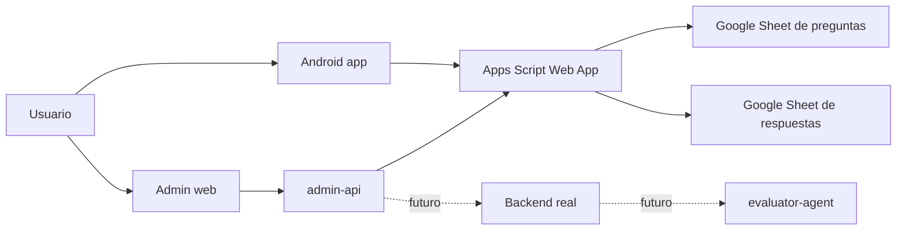
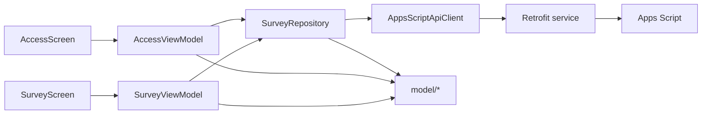
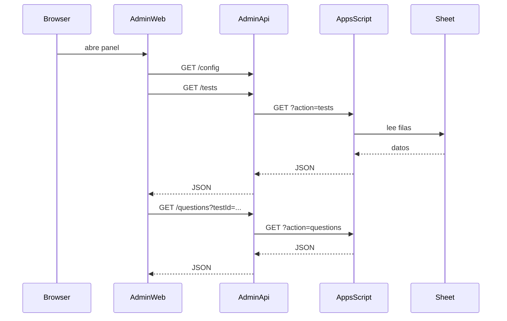

# Skillnea

`Skillnea` es un monorepo para una app de evaluacion orientada a RRHH y conducta, con una app Android, un panel admin web, una API local intermedia y una capa temporal basada en Google Sheets + Apps Script.

El objetivo actual del repositorio es simple:

- la app Android carga una encuesta remota y envia respuestas
- el panel web permite visualizar tests y preguntas desde un gateway local
- Apps Script sirve como backend temporal
- el repo ya queda preparado para evolucionar hacia backend real, panel de respuestas y agente evaluador

## Estado actual

Lo que ya esta montado:

1. App Android con arquitectura MVVM clara y separada por carpetas.
2. Panel admin web desacoplado del backend temporal.
3. `admin-api` como gateway local para evitar acoplar la web directamente a Apps Script.
4. Dockerizacion de la web admin con `Nginx + proxy /api`.
5. Contrato base en OpenAPI para alinear mobile, web y servicios.

## Mapa del monorepo

```text
.
├── apps
│   ├── admin-web
│   └── mobile-android
├── docs
├── infra
│   └── docker
├── packages
│   └── contracts
└── services
    ├── admin-api
    ├── apps-script-api
    └── evaluator-agent
```

## Arquitectura general



### Lectura rapida de capas

- `apps/mobile-android`: cliente final para participantes.
- `apps/admin-web`: panel visual para operacion y administracion.
- `services/admin-api`: gateway local y futura puerta de entrada estable.
- `services/apps-script-api`: implementacion temporal para Google Sheets.
- `packages/contracts`: contratos compartidos.

## Arquitectura Android

La app Android ya no esta mezclada entre `feature`, `core` y `ui`; ahora sigue una separacion mas clara:

```text
apps/mobile-android/app/src/main/java/com/skillnea/mobile
├── config
│   └── ApiConfig.kt
├── data
│   ├── remote
│   │   ├── AppsScriptApiClient.kt
│   │   ├── AppsScriptApiService.kt
│   │   ├── NetworkModule.kt
│   │   └── dto
│   │       └── SurveyDtos.kt
│   └── repository
│       └── SurveyRepository.kt
├── model
│   ├── AccessModels.kt
│   ├── SurveyModels.kt
│   └── SurveyUiState.kt
├── view
│   ├── SkillneaApp.kt
│   ├── access
│   ├── result
│   ├── survey
│   └── theme
└── viewmodel
    ├── AccessViewModel.kt
    └── SurveyViewModel.kt
```

### Flujo MVVM



### Responsabilidad de carpetas Android

- `model`: entidades de dominio y `UiState`.
- `viewmodel`: logica de pantalla, validacion y coordinacion.
- `view`: Compose, navegacion local y tema.
- `data/repository`: interfaz estable para consumo desde `ViewModel`.
- `data/remote`: cliente, servicio, DTOs y configuracion de red.
- `config`: resolucion de endpoints y flags de integracion.

## Arquitectura web admin

La web ahora queda preparada para dos modos:

1. desarrollo local con Vite
2. despliegue local con Docker usando `Nginx` y proxy `/api`



## Backend temporal con Apps Script

Actualmente el backend temporal esta pensado para una hoja con estas columnas:

- `id`
- `disposition`
- `level`
- `rubric`
- `question`

La implementacion esta en [services/apps-script-api/SkillneaSurveyApi.gs](./services/apps-script-api/SkillneaSurveyApi.gs).

Endpoints actuales:

- `GET ?action=health`
- `GET ?action=schema`
- `GET ?action=tests`
- `GET ?action=dispositions`
- `GET ?action=questions&testId=critical-thinking-rubric`
- `POST ?action=submit`

## Contrato compartido

El contrato base esta en [packages/contracts/skillnea-survey.openapi.yaml](./packages/contracts/skillnea-survey.openapi.yaml).

Ese contrato debe seguir siendo la referencia para:

- app Android
- panel web
- gateway local
- futuro backend real
- futuro evaluador

## Puesta en marcha

### Requisitos

- Android Studio
- JDK 21
- Node.js 20
- npm
- Docker Desktop con WSL operativo si quieres usar contenedores

### Android

1. Abre [apps/mobile-android](./apps/mobile-android) en Android Studio.
2. Copia [apps/mobile-android/secret.properties.example](./apps/mobile-android/secret.properties.example) a `secret.properties`.
3. Rellena:

```properties
APPS_SCRIPT_BASE_URL=https://script.google.com/macros/s/TU_DEPLOYMENT/exec
APPS_SCRIPT_DEPLOYMENT_ID=TU_DEPLOYMENT
```

4. Compila:

```bash
./gradlew :app:assembleDebug
```

### Admin web en desarrollo local

1. Copia [services/admin-api/.env.example](./services/admin-api/.env.example) a `.env`.
2. Rellena `APPS_SCRIPT_BASE_URL` y `APPS_SCRIPT_DEPLOYMENT_ID`.
3. Arranca la API:

```bash
cd services/admin-api
npm run dev
```

4. Arranca la web:

```bash
cd apps/admin-web
npm install
npm run dev
```

5. Abre `http://localhost:5173`.

### Admin web con Docker

```bash
docker compose -f infra/docker/compose.local.yml -p skillnea_local up -d --build
```

Puertos previstos:

- web: `http://localhost:5173`
- admin-api: `http://localhost:8080`

Nota: en Windows, este camino depende de que Docker Desktop y WSL esten sanos. Si el daemon no arranca, el problema es del host, no del `compose`.

## Seguridad y gestion de secretos

### Que se trackea

Se trackean:

- codigo fuente
- `Dockerfile`, `compose`, `nginx.conf`
- contratos
- `.env.example`
- `secret.properties.example`
- documentacion

### Que no se trackea

Se ignoran por Git:

- `.env`
- `.env.*` excepto `.env.example`
- `secret.properties`
- `secrets.properties`
- `node_modules`
- `dist`
- builds de Android
- logs y `tmp-logs/`

### Reglas actuales de seguridad

1. No hay claves reales ni endpoints sensibles persistidos en archivos trackeados.
2. La app Android lee secretos desde `secret.properties`.
3. `admin-api` lee secretos desde `.env`.
4. La web Dockerizada no necesita exponer claves en cliente; consume `/api`.
5. `Apps Script` con acceso publico debe considerarse temporal, no un modelo de seguridad final.


## Limpieza y criterios del repo

Limpiezas ya hechas:

- se elimino codigo Android legacy ya no usado
- se quitaron componentes muertos de UI
- se sustituyo la web en Docker basada en `vite dev` por un build real con `Nginx`
- los secretos locales quedan fuera de Git por regla

## Comandos utiles

### Android

```bash
./gradlew :app:assembleDebug
```

### Web

```bash
cd apps/admin-web
npm run build
```

### Admin API

```bash
cd services/admin-api
npm run dev
```

### Docker

```bash
docker compose -f infra/docker/compose.local.yml -p skillnea_local up -d --build
docker compose -f infra/docker/compose.local.yml -p skillnea_local ps
docker compose -f infra/docker/compose.local.yml -p skillnea_local down
```

## Documentacion adicional

- [docs/versioning.md](./docs/versioning.md)
- [apps/mobile-android/README.md](./apps/mobile-android/README.md)
- [services/admin-api/README.md](./services/admin-api/README.md)
- [services/apps-script-api/README.md](./services/apps-script-api/README.md)

